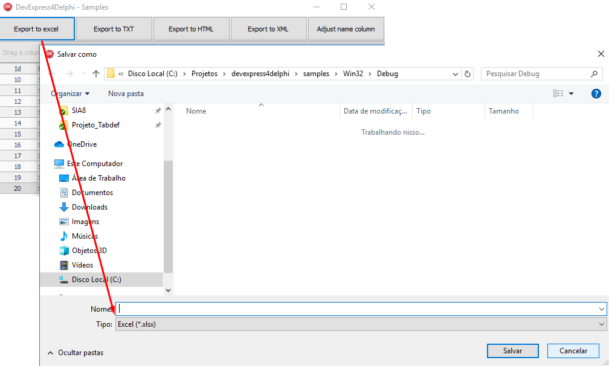
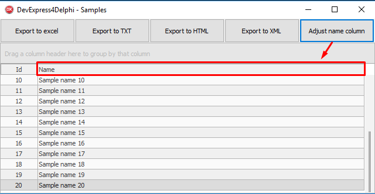

# DevExpress Helper for Delphi


 
DevExpress4Delphi is a class helper for DevExpress components.
 
## Prerequisites
 * [**DevExpress**](https://www.devexpress.com/products/vcl/) - VCL Components for Delphi and C++Builder
 * `[Optional]` For ease I recommend using the [**Boss**](https://github.com/HashLoad/boss) (Dependency Manager for Delphi) for installation
 
## Installation using Boss (dependency manager for Delphi applications)
```
boss install github.com/viniciussanchez/DevExpress4Delphi
```

## Manual Installation
Add the following folders to your project, in *Project > Options > Resource Compiler > Directories and Conditionals > Include file search path*
```
../DevExpress4Delphi/src
```

## Getting Started
You need to use DevExpress.Helper
```pascal
uses DevExpress.Helper;
```

## Export

You can pass two parameters:
 * `AOpenFileAfter`: Open file after export. Default is True.
 * `AExpand`: Expand records. Default is True.

#### Exporting to Excel

```pascal
begin
  cxGrid1.ExportToExcel();
end;
```

#### Exporting to HTML

```pascal
begin
  cxGrid1.ExportToHTML();
end;
```

#### Exporting to XML

```pascal
begin
  cxGrid1.ExportToXML();
end;
```

#### Exporting to file text

```pascal
begin
  cxGrid1.ExportToTXT();
end;
```

## Adjust the size of the column

You can pass parameter:
 * `AMaxWidth`: Refers the maximum column width.

```pascal
begin
  cxGrid1DBTableViewNAME.Resize();  
end;
```

## Samples

Exporting to excel:



Adjusting the size of the column so that there is no white space on the grid:


